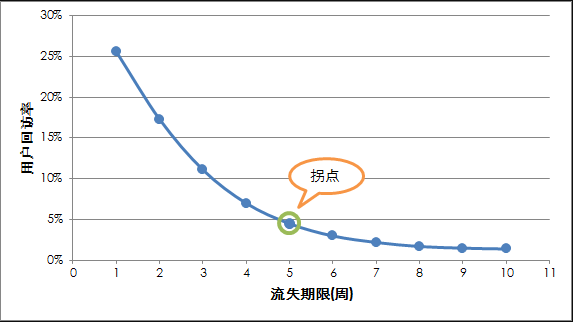

# 用户分析

## 怎样合理地定义用户流失

流失用户：就是一段时间内未访问或登录过网站的用户，一般流失用户都是对于那些需要注册、提供应用服务的网站而言的，比如微博、邮箱、电子商务类网站等。

难点： 合理地去定义用户流失时间段长度的问题；

思路：使用用户回访率验证对用户流失周期定义的合理性；

方法：用户回访率 = 回访用户数 ÷ 流失用户数 × 100%

执行： 计算用户本次访问时间与上一次访问时间差，人工划定不同的周期（30,60,90）计算回访用户数和流失用户数，从而计算用户回访率；

具体资料

回访用户：指流失之后再次访问网站的用户，即用户曾经流失过，满足流失时间期限内完全没有访问/登录网站的条件，但之后重新访问/登录网站。然后，根据回访用户数可以计算得到用户回访率；

用户回访率 = 回访用户数 ÷ 流失用户数 × 100%

回访用户率的数值大小间接地可以验证对用户流失定义的合理性。一般情况下，网站的用户回访率应该在10%以下，在5%左右的数值是比较合理的，对于成熟的网站而言用户回访率会稍高，而新兴的网站的用户回访率通常更低，尤其像手机APP这类用户易流失的产品。

流失期限与用户回访率

用户流失的流失期限的长度与用户的回访率成反比，我们在定义用户流失时使用的连续不访问/登录网站的期限越长，这批流失用户之后回访网站的概率就会越低，并且随着定义的流失期限的增大，用户回访率一定是递减的，并逐渐趋近于0。那么如果选择合适的流失期间长度？我们可以设定不同的流失期限长度，进一步统计每个流失期限的用户回访率，并观察用户回访率随定义的流失期限增大时的收敛速度。如果以“周”为单位设定流失期限：

根据设定的不同流失周期的用户回访率的变化曲线，我们可以使用拐点理论（Elbow Method）选择最合适的流失周期。

拐点理论：X轴上数值的增加会带来Y轴数值大幅增益（减益），直到超过某个点之后，当X增加时Y的数据增益（减益）大幅下降，即经济学里面的边际收益的大幅减少，那个点就是图表中的“拐点”。比如上图中流失周期增加到5周的时候，用户回访率的缩减速度明显下降，所以这里的5周就是拐点，我们可以用5周作为定义用户流失的期限，即一个之前访问/登录过的用户，如果之后连续5周都没有访问/登录，则定义该用户流失。

所以，有个这个办法之后，就能更加合理地定义流失用户的统计逻辑，而之前要做的就是选择不同的流失期限分别计算用户的回访率，然后用统计的到的数值生成如上的一张带平滑线的散点图，问题就迎刃而解。 :)

参考网址：[怎样合理地定义用户流失](http://webdataanalysis.net/personal-view/how-to-define-churn-user/)
